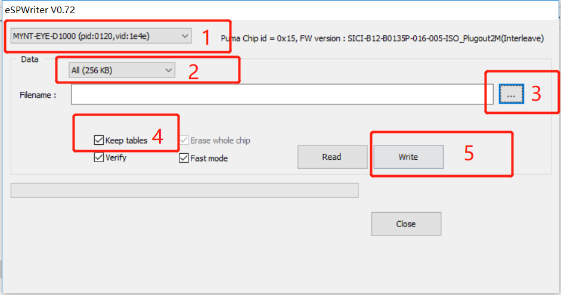

.. role:: raw-latex(raw)
   :format: latex
..

.. _update_camera_firmware:

Update Camera Firmware
======================

.. note::
 This tool does not support beta device upgrade.

Get Firmware
------------

Latest firmware: SICI-B12-B0135P-016-005-ISO_Plugout2M(Interleave).bin
`Google
Drive <https://drive.google.com/open?id=1gAbTf6W10a8iwT7L9TceMVgxQCWKnEsx>`__,
`Baidu Pan <https://pan.baidu.com/s/1sZKxugg5P8Dk5QgneA9ttw>`__

Get Update Tool
---------------

Latest tool: EtronWriter_1.0.6.zip `Google
Drive <https://drive.google.com/open?id=1gAbTf6W10a8iwT7L9TceMVgxQCWKnEsx>`__,
`Baidu Pan <https://pan.baidu.com/s/1sZKxugg5P8Dk5QgneA9ttw>`__

Update Firmware
---------------

.. note::
 Please follow the steps to upgrade firmware.(Otherwise, the
 camera calibration parameters will be lost.)

 1, Select camera device.

 2, Select data type(256KB).

 3, Select camera firmware.

 4, Select ``Keep tables`` (in order to keep calibration parameters).

 5, Click ``Write``.

Use the tool according to diagram:

.. raw:: latex

   \latexonly

:raw-latex:`\includegraphics[width=1\textwidth]{update_camera_tool.png}`
:raw-latex:`\endlatexonly`
