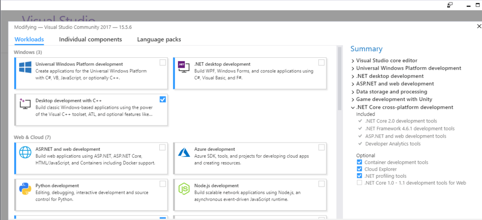

.. _build_win:

Quick Start Guide for Windows
=============================

The following steps are how to install from source codes. If you wanna
using prebuilt DLL, please see :ref:`install_exe_win` .

1. Install Build Tools
----------------------

1.1 Install Visual Studio
~~~~~~~~~~~~~~~~~~~~~~~~~

Download Visual Studio 2017 from https://visualstudio.microsoft.com/ and
install, select "Desktop development with C++" .

.. tip::

   support Visual Studio 2015 and Visual Studio 2017.

1.2 Install CMake
~~~~~~~~~~~~~~~~~

Download CMake from https://cmake.org/ and install

1.3 Install MSYS2
~~~~~~~~~~~~~~~~~

1) Download MSYS2 from http://mirrors.ustc.edu.cn/msys2/distrib/x86_64/
   and install

2) Add bin path to System PATH environment variable list (`Add to the PATH on Windows 10 <https://www.architectryan.com/2018/03/17/add-to-the-path-on-windows-10/>`__)

.. code-block:: none

   C:\msys64\usr\bin

3) Install make

.. code-block:: bat

   pacman -Syu
   pacman -S make

Finally, the CMD (Command Prompt) can run the following command:

.. code-block:: bat

  >make --version
  GNU Make 4.2.1

2. Install SDK dependencies
---------------------------

2.1 Install OpenCV
~~~~~~~~~~~~~~~~~~

2.1.1 Install OpenCV with Pre-built Libraries (Recommend)
^^^^^^^^^^^^^^^^^^^^^^^^^^^^^^^^^^^^^^^^^^^^^^^^^^^^^^^^^

*For more details you can reference `OpenCV offical document <https://docs.opencv.org/3.4.2/d3/d52/tutorial_windows_install.html>`_ *

1) Go to OpenCV Sourceforge page
   http://sourceforge.net/projects/opencvlibrary/files/opencv-win/
2) Choose a build you want to use and download it. For example
   3.4.2/opencv-3.4.2-vc14_vc15.exe
3) Make sure you have admin rights. Unpack the self-extracting archive
4) To finalize the installation, go to set the OpenCV environment
   variable and add it to the systems path

2.1.2 Set up environment variable
^^^^^^^^^^^^^^^^^^^^^^^^^^^^^^^^^

1. Start up a command window as admin and enter following command to add ``OPENCV_DIR`` environment variable:

*Change the “D:\OpenCV” to your opencv unpack path*

.. code-block:: bat

   setx -m OPENCV_DIR D:\OpenCV\Build\x64\vc14\lib     (suggested for Visual Studio 2015 - 64 bit Windows)
   setx -m OPENCV_DIR D:\OpenCV\Build\x64\vc15\lib     (suggested for Visual Studio 2017 - 64 bit Windows)

Or referring to `Add to the PATH on Windows 10 <https://www.architectryan.com/2018/03/17/add-to-the-path-on-windows-10/>`__
to add ``OPENCV_DIR`` environment variable manually.

.. code-block:: bat

   D:\OpenCV\Build\x64\vc14\lib     (suggested for Visual Studio 2015 - 64 bit Windows)
   D:\OpenCV\Build\x64\vc15\lib     (suggested for Visual Studio 2017 - 64 bit Windows)

2. Add OpenCV bin path to System PATH environment variable list

.. code-block:: bat

   D:\OpenCV\Build\x64\vc14\bin     (suggested for Visual Studio 2015 - 64 bit Windows)
   D:\OpenCV\Build\x64\vc15\bin     (suggested for Visual Studio 2017 - 64 bit Windows)

2.2 Install libjpeg-turbo
~~~~~~~~~~~~~~~~~~~~~~~~~

1) Download libjpeg-turbo from
   https://sourceforge.net/projects/libjpeg-turbo/files/ and install

2) Add bin path to System PATH environment variable list

.. code-block:: none

   C:\libjpeg-turbo64\bin

2.3 Install PCL for Point Cloud sample (Optional)
~~~~~~~~~~~~~~~~~~~~~~~~~~~~~~~~~~~~~~~~~~~~~~~~~

Download All-in-one installers (PCL + dependencies) from:
https://github.com/PointCloudLibrary/pcl/releases

3. Build SDK
------------

Open “x64 Native Tools Command Prompt for VS 2017”(suggested for Visual Studio 2017 - 64 bit Windows) command shell

.. code-block:: bat

   git clone https://github.com/slightech/MYNT-EYE-D-SDK.git
   cd MYNT-EYE-D-SDK
   make all

.. tip::

  Visual Studio Command Prompt can be opened from the Start menu,

  .. image:: ../static/images/vs_cmd_menu.png
    :width: 30%

  You can also open it from the Visual Studio Tools menu.

  .. image:: ../static/images/vs_cmd.png
    :width: 40%

  However, if you do not have the Visual Studio 2015 Tools menu, you can add one yourself.

  Open Tools's External Tools... and Add the following:

  ================= =======================================================================================
  Field             Value
  ================= =======================================================================================
  Title             Visual Studio Command Prompt
  Command           ``C:\Windows\System32\cmd.exe``
  Arguments         ``/k "C:\Program Files (x86)\Microsoft Visual Studio 14.0\Common7\Tools\VsDevCmd.bat"``
  Initial Directory ``$(SolutionDir)``
  ================= =======================================================================================

4. Run Samples
--------------

   Note: Open the rectified image by default (Run vio need to raw image,
   run depth or points cloud need to rectified image.)

1) get_image shows the left camera image and colorful depthmap
   (compatible with USB2.0)

.. code-block:: bat

   .\samples\_output\bin\get_image.bat

2) get_stereo_image shows the left camera image and colorful depthmap

.. code-block:: bat

   ./samples/_output/bin/get_stereo_image.bat

3) get_depth shows the left camera image, 16UC1 depthmap and depth
   value(mm) on mouse pointed pixel

.. code-block:: bat

   .\samples\_output\bin\get_depth.bat

4) get_points shows the left camera image, 16UC1 depthmap and point
   cloud view

.. code-block:: bat

   .\samples\_output\bin\get_points.bat

5) get_imu shows motion datas

.. code-block:: bat

   .\samples\_output\bin\get_imu

6) get_img_params show camera intrinsics and save in file

.. code-block:: bat

   .\samples\_output\bin\get_img_params

7) get_imu_params show imu intrinsics and save in file

.. code-block:: bat

   .\samples\_output\bin\get_imu_params

8) get_from_callbacks show image and imu data by callback

.. code-block:: bat

   .\samples\_output\bin\get_from_callbacks

9) get_all_with_options open device with different options

.. code-block:: bat

   .\samples\_output\bin\get_all_with_options

5. Clean
--------

.. code-block:: bat

   cd <sdk>  #local path of MYNT-EYE-D-SDK
   make cleanall
