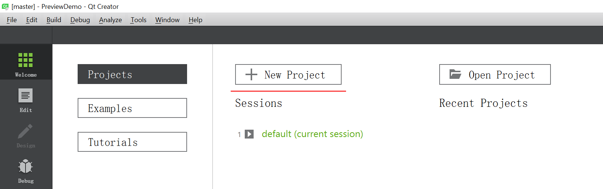
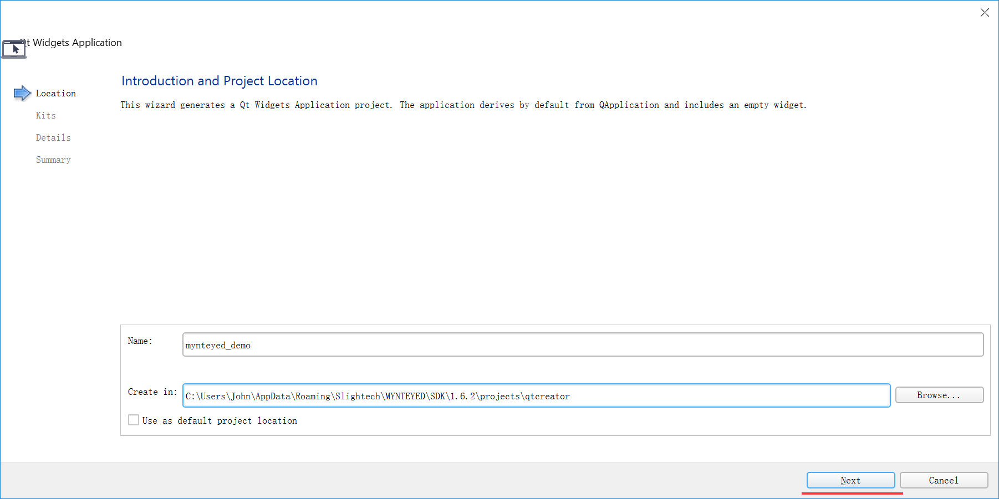
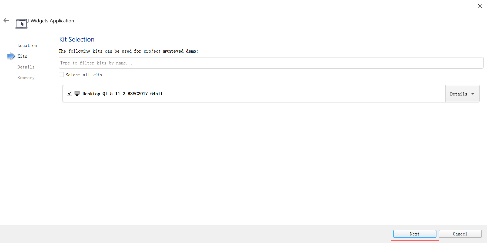
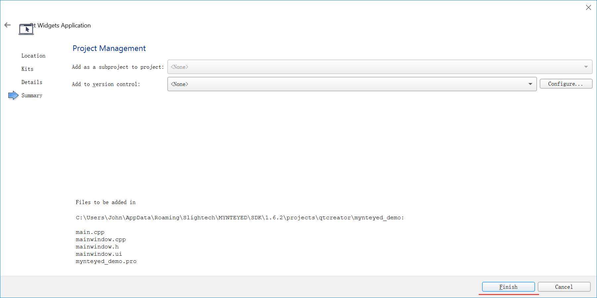
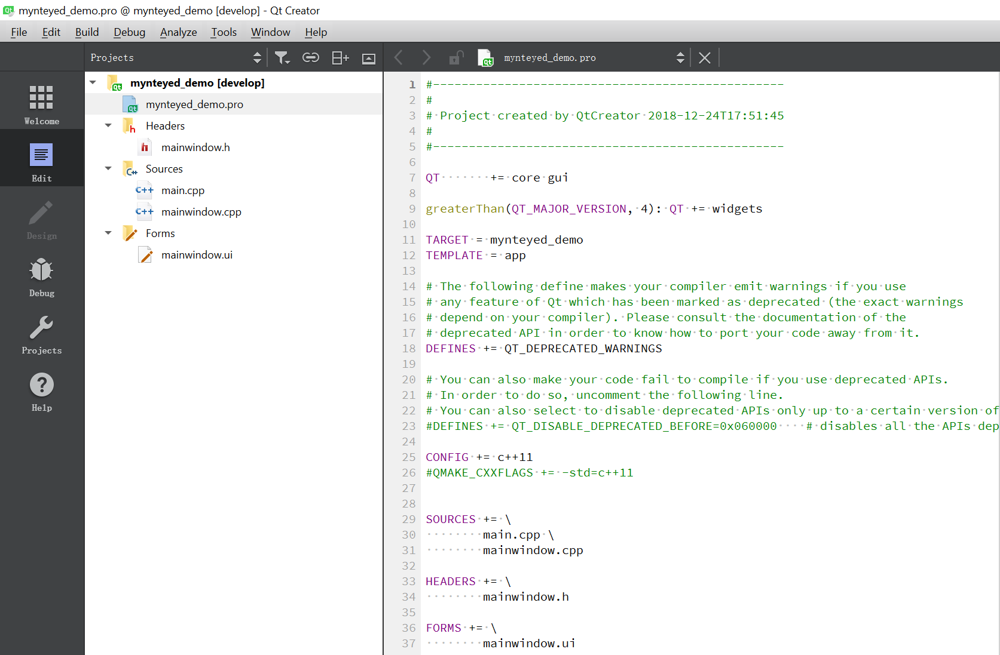
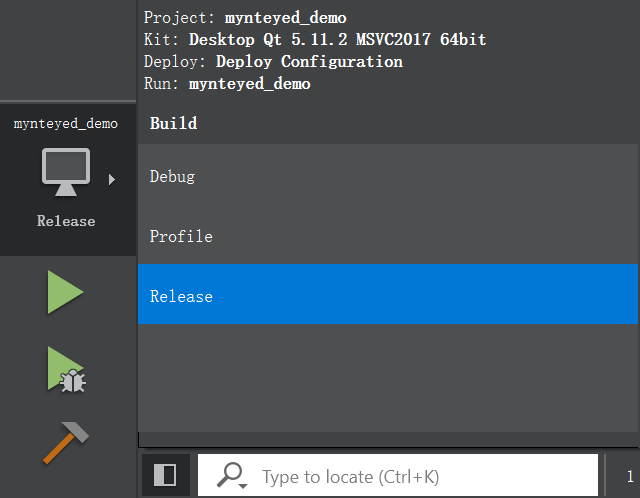
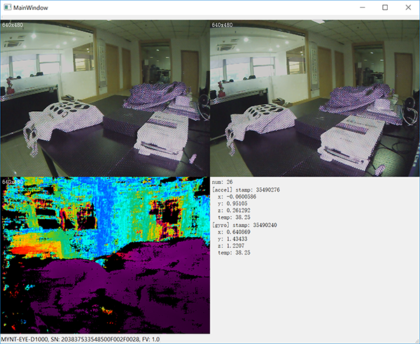
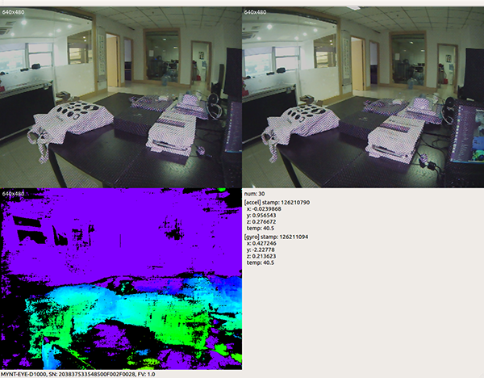

.. _qtcreator:

How to use SDK with Qt Creator
==============================

This tutorial will create a Qt project with Qt Creator to start using
SDK.

   You could find the project demo in
   ``<sdk>/platforms/projects/qtcreator`` directory.

Preparation
-----------

-  Windows: install the win pack of SDK
-  Linux: build from source and ``make install``

Create Project
--------------

Open Qt Creator, then ``New Project``,

Choose ``Qt Widgets Application``,

.. image:: ../static/images/projects/qtcreator/new_project2.png

Set project location and its name,

Select the build kits,

Then, it will generate the skeleton source files,

.. image:: ../static/images/projects/qtcreator/new_project5.png

Finally, you will see the new project like this,

Config Project
--------------

Edit ``mynteyed_demo.pro`` to add ``INCLUDEPATH`` and ``LIBS``.

.. code-block:: bash

   win32 {
       SDK_ROOT = "$$(MYNTEYED_SDK_ROOT)"
       isEmpty(SDK_ROOT) {
           error( "MYNTEYED_SDK_ROOT not found, please install SDK firstly" )
       }
       message("SDK_ROOT: $$SDK_ROOT")

       INCLUDEPATH += "$$SDK_ROOT/include"
       LIBS += "$$SDK_ROOT/lib/mynteye_depth.lib"
   }

   unix {
       INCLUDEPATH += /usr/local/include
       LIBS += -L/usr/local/lib -lmynteye_depth
   }

Start using SDK
---------------

Include the headers of SDK and start using its APIs, could see the
project demo.

Windows
~~~~~~~

Should select “Release” to run the project.

Then you will see the main window,

Linux
~~~~~

Run the project and you will see the main window,

