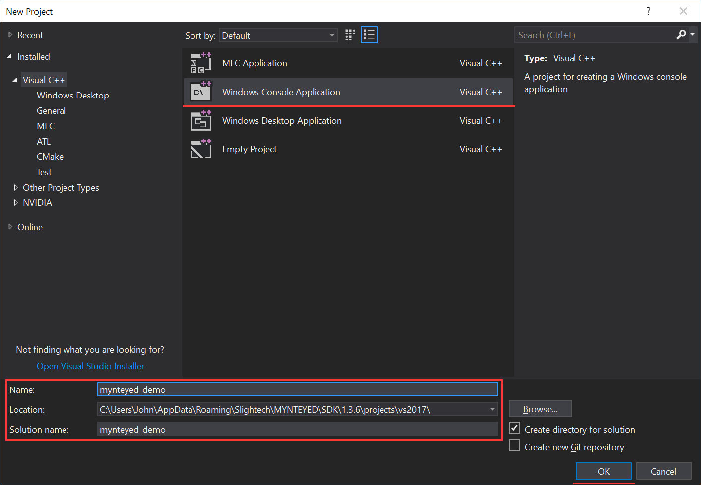
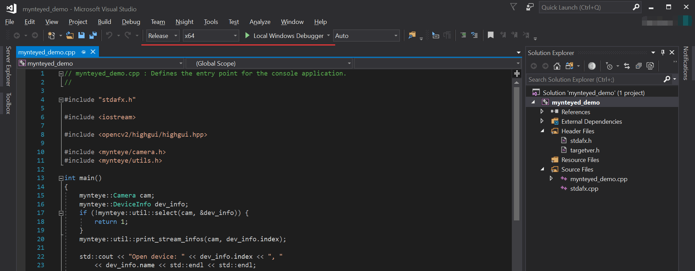

.. _vs2017:

How to use SDK with Visual Studio 2017
======================================

This tutorial will create a project with Visual Studio 2017 to start
using SDK.

   You could find the project demo in
   ``<sdk>/platforms/projects/vs2017`` directory.

Preparation
-----------

-  Windows: install the win pack of SDK

Create Project
--------------

Open Visual Studio 2017, then ``File > New > Project``,

.. image:: ../static/images/projects/vs2017/1_new_pro.png

Select “Windows Console Application”, set the project’s name and
location, click “OK”,

Finally, you will see the new project like this,

.. image:: ../static/images/projects/vs2017/3_new_pro.png

Config Properties
-----------------

Right click the project, and open its “Properties” window,

.. image:: ../static/images/projects/vs2017/4_config.png

Change “Configuration” to “All Configurations”, then add the following
paths to “Additional Include Directories”,

.. code:: bash

   $(MYNTEYED_SDK_ROOT)\include
   $(MYNTEYED_SDK_ROOT)\3rdparty\opencv\build\include

.. image:: ../static/images/projects/vs2017/5_config_include.png

Add the following definitions to “Preprocessor Definitions”,

.. code:: bash

   WITH_OPENCV
   WITH_OPENCV3

.. image:: ../static/images/projects/vs2017/6_config_definition.png

Add the following paths to “Additional Library Directories”,

.. code:: bash

   $(MYNTEYED_SDK_ROOT)\lib
   $(MYNTEYED_SDK_ROOT)\3rdparty\opencv\build\x64\vc15\lib

.. image:: ../static/images/projects/vs2017/7_config_lib_dir.png

Add the following libs to “Additional Dependencies”,

.. code:: bash

   mynteye_depth.lib
   opencv_world343.lib

.. image:: ../static/images/projects/vs2017/8_config_lib.png

Start using SDK
---------------

Include the headers of SDK and start using its APIs,

Select “Release x64” to run the project.
