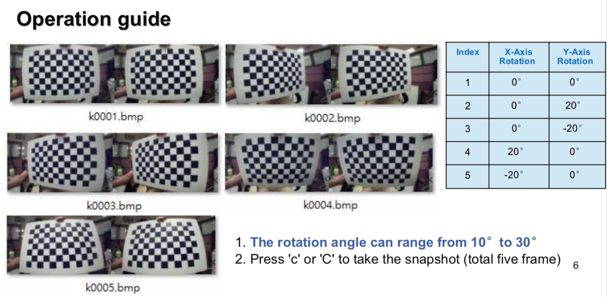

.. _calibration_tool:

Calibration Tool Manual
=======================

Get Calibration Tool
--------

Latest tool:  mynteye-d-calibrator_1.0.zip `Google
Drive <https://drive.google.com/open?id=13QsqgkzNfh4yKDisYgHXtshzFyqRzbDs>`__,
`Baidu Pan <https://pan.baidu.com/s/11gbg_KkzaezNa52YfdMjJw>`__

Prerequisites(Update config file)
--------

* You can find Depth 50°'s config file in ``D1000-50`` , Depth 120°'s config file in ``D1000-120`` 。
* Config file in ``HD`` folder means using for 720p, ``VGA`` for 480p. You need calibrate both resolution for camera.
* Copy and paste ``eDepthK.prj`` to ``mynteye-d-calibrator_1.0`` folder.
* Open ``eDepthK.prj`` with txt and modify Col1/2/3/4 to chessboard width, Row1/2/3/4 to chessboard height, Size1/2/3/4 to chessboard square size in meters.
* Chessboard width and height refer to the number of black and white intersections in the horizontal and vertical directions of the checkerboard.

Example of 11x7 Intersection Chess Board
-------

.. image:: ../static/images/tools/calibration005.png
   :width: 80%

Parameters of eSPCalibrator
-------

.. image:: ../static/images/tools/calibration004.png
   :width: 80%

1.Open eDepthK.prj
2.Note that 'Col1' 'Row1' 'Size1' must match your chess board

Calibration Procedure 1 (Yoffset)
--------

* If you are calibrating VGA mode，please skip this procedure.
* Calibration Process 1 need 1 picture.
* The chess board must right in front of both camera and cover maximum portion(over 50%) of the preview image(try your best)
* Press 'c' or 'C' to take the snapshot of the properly positioned chess board. If calibrator can not detect all the intersections on preview image, you will get “Not Found” result.

Operation guide
--------

1.Double click mynteye-d-calibrator.exe
2.Press 'c' or 'C' to take the snapshot (total one frame)

.. image:: ../static/images/tools/calibration001.png
   :width: 80%

Calibration Procedure 2 (Calibration)
--------

* Calibration need 5 pictures in 5 different angles

* The required angles will be the combination of rotation along X and
Y axis. Each Rotation angle should be 10° to 30° and/or Y-axis
around X- axis

* The chess board must cover the maximum portion(over 50%)
of the preview image from both camera(try your best)

* Press 'c' or 'C' to take the snap shot of the properly positioned chess board. If calibrator can not detect all the intersections on the chess board, you will get “Not Found” result.

Operation guide
--------

Calibration Result
-------

* After calibration, parameters will auto write into device.

.. image:: ../static/images/tools/calibration003.png
   :width: 80%

* After caliobration, you can get ``Reprojection error`` in log file ``StereoSetting.txt`` , it is desirable to have a reprojection error of 0.2 or less.  If exceeds 0.5, it needs to be recalibrated.

Log File
-------

* After caliobration, log file will save into ``Log_Folder`` .

.. image:: ../static/images/tools/calibration006.png
   :width: 80%

Appendix
-------

Error_Message : Yoffset
-------

========================================  ==================================================================
Error Message                             Possible root cause
========================================  ==================================================================
Yoffset Not support format.               1. FW issue, check page.14 2. eDepthK.prj setting error
No Device                                 1. USB unstable
Yoffset Cannot Preview Resolution         1. FW issue, check page.14 2. eDepthK.prj setting error
========================================  ==================================================================

Error_Message : Calibration
-------

========================================  ==================================================================
Error Message                             Possible root cause
========================================  ==================================================================
Calibration Not support format.           1. FW issue, check page.14  2. eDepthK.prj setting error
No Device                                 1. USB unstable
Calibration Cannot Preview Resolution     1. FW issue, check page.14 2. eDepthK.prj setting error
Calibration fail : Calib_Line_Buffer_Err  1. linebuffer > 160, quality error
Calibration fail : Calib_reproject_err    1. reprojection err > 1.75, quality error
Calibration Write flash fail              1. FW issue, check page.14
========================================  ==================================================================

Error_Message : ZD
-------

========================================  ==================================================================
Error Message                             Possible root cause
========================================  ==================================================================
ZD initialization Fail                    1. FW issue, check page.14 2. eDepthK.prj setting error
No Device                                 1. USB unstable
Cannot Preview Resolution                 1. FW issue, check page.14 2. eDepthK.prj setting error
Write ZD Table Fail                       1. FW issue, check page.14
========================================  ==================================================================

