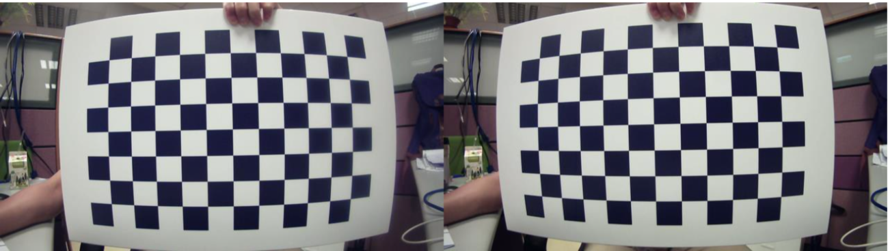
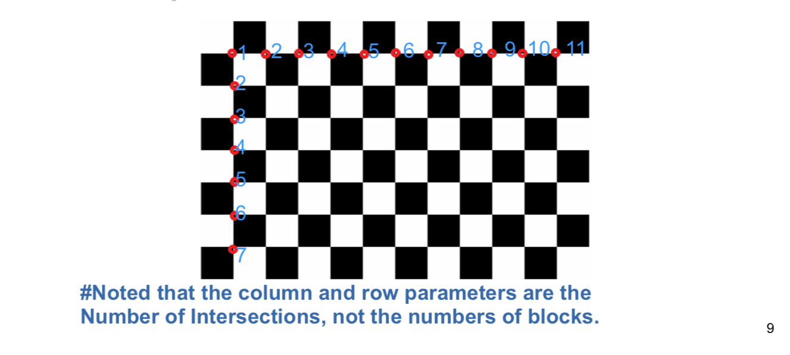
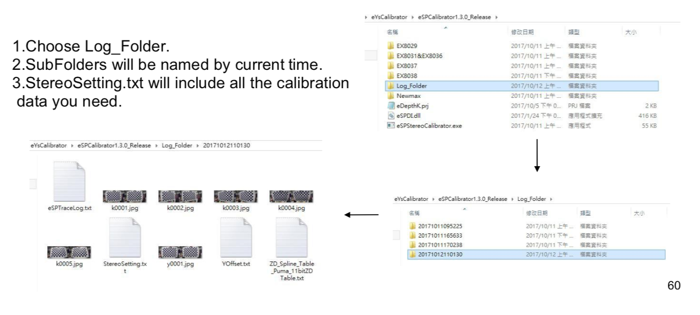

.. _calibration_tool:

MYNT EYE D Manual Calibration Tool
==========

Introduction
--------

This manual calibration tool can generate both calibration data and ZD table (disparity to distance). The calibrator equipment configuration mainly involves two items; the size of the chess board and the distance between camera module and chess board

* The recommended distance between chess board and camera module is the working distance of the target application

* The recommended size of the chess board is that the chess board shall cover the maximum portion(over 50%) of the preview image from both camera

Calibration Procedure 1 (Yoffset)
--------

* Calibration Process 1 need 1 picture.
* The chess board must right in front of both camera and cover maximum portion(over 50%) of the preview image(try your best)
* Press 'c' or 'C' to take the snapshot of the properly positioned chess board. If calibrator can not detect all the intersections on preview image, you will get “Not Found” result.

Operation guide
--------

1.Double click eSPCalibrator.exe
2.Press 'c' or 'C' to take the snapshot (total one frame)

Calibration Procedure 2 (Calibration)
--------

* Calibration need 5 pictures in 5 different angles

* The required angles will be the combination of rotation along X and
Y axis. Each Rotation angle should be 10° to 30° and/or Y-axis
around X- axis 

* The chess board must cover the maximum portion(over 50%)
of the preview image from both camera(try your best)

* Press 'c' or 'C' to take the snap shot of the properly positioned chess board. If calibrator can not detect all the intersections on the chess board, you will get “Not Found” result.

Operation guide
--------

.. image:: ../images/calibration002.png
   :width: 60%

Calibration Result
-------

.. image:: ../images/calibration003.png
   :width: 60%

Parameters of eSPCalibrator
-------

.. image:: ../images/calibration004.png
   :width: 60%

1.Open eDepthK.prj
2.Note that 'Col1' 'Row1' 'Size1' must match your chess board

Example of 11x7 Intersection Chess Board
-------

Log File
-------

Appendix
-------

Error_Message : Yoffset
-------

========================================  ==================================================================
Error Message                             Possible root cause
========================================  ==================================================================
Yoffset Not support format.               1. FW issue, check page.14 2. eDepthK.prj setting error
No Device                                 1. USB unstable
Yoffset Cannot Preview Resolution         1. FW issue, check page.14 2. eDepthK.prj setting error                              
========================================  ==================================================================

Error_Message : Calibration
-------

========================================  ==================================================================
Error Message                             Possible root cause
========================================  ==================================================================
Calibration Not support format.           1. FW issue, check page.14  2. eDepthK.prj setting error
No Device                                 1. USB unstable
Calibration Cannot Preview Resolution     1. FW issue, check page.14 2. eDepthK.prj setting error
Calibration fail : Calib_Line_Buffer_Err  1. linebuffer > 160, quality error
Calibration fail : Calib_reproject_err    1. reprojection err > 1.75, quality error
Calibration Write flash fail              1. FW issue, check page.14
========================================  ==================================================================

Error_Message : ZD
-------

========================================  ==================================================================
Error Message                             Possible root cause
========================================  ==================================================================
ZD initialization Fail                    1. FW issue, check page.14 2. eDepthK.prj setting error
No Device                                 1. USB unstable
Cannot Preview Resolution                 1. FW issue, check page.14 2. eDepthK.prj setting error
Write ZD Table Fail                       1. FW issue, check page.14
========================================  ==================================================================

FW version verification
-------

The following FW version are verified. Any update/upgrade will not be guarantee!!

1. EX8031-B01-B0135P-BL60U-011-EnDepthPostProcess(U3 HD,VGA)
2. EX8036-B01-B0135P-BL60U-011-EnDepthPostProcess(U3 HD,VGA)
3. EX8037-B01-A9714M-BL40U-005-EnDepthPostProcess(U2 HD,VGA)
4. EX8038-B01-B0144M-BL60U-002(U3 HD)
5. Vivian-B01-B0135P-BL60U-006(U3 color 1920x960, calibrationcolor 1440x720 depth 580x580)

Yoffset not work, because its sensor swap

